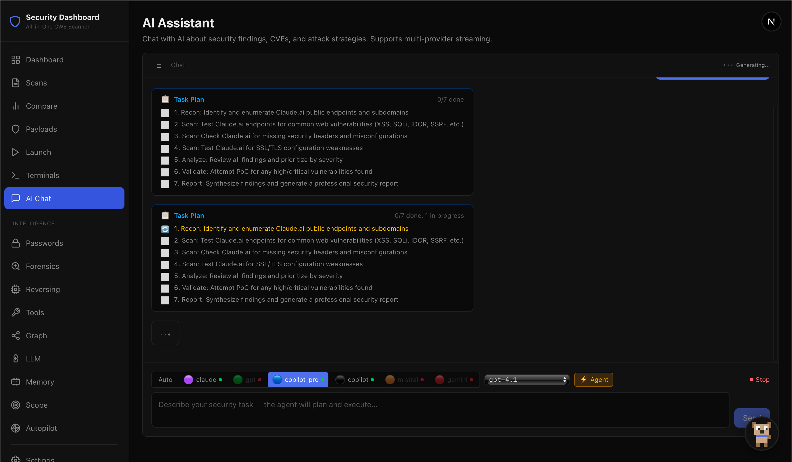
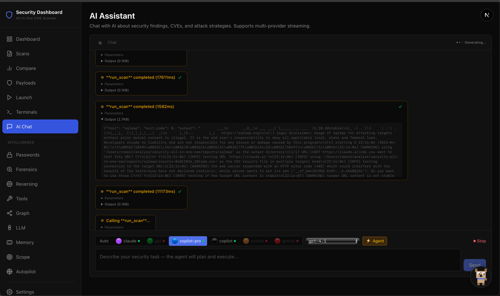

# 🛡️ Security All-in-One CWE — Bug Bounty Testing Suite


Suite complète de **70+ outils** de sécurité offensive pour le bug bounty, organisée par catégorie CWE.
Tous les outils tournent via Docker Compose — un seul `make run` pour tout lancer.

---

## 📋 Table des matières

- [Installation rapide](#-installation-rapide)
- [Méthodes d&#39;installation](#-méthodes-dinstallation)
- [Architecture](#-architecture)
- [Les 70+ outils](#-les-70-outils)
- [Tutoriel d&#39;utilisation](#-tutoriel-dutilisation)
- [Commandes Make](#-commandes-make)
- [Mapping CWE → Outil](#-mapping-cwe--outil)
- [Reporting](#-reporting)
- [Profils Docker](#-profils-docker)
- [Dépannage](#-dépannage)

---

## � Screenshots & Démo






**Vidéo démo 60 secondes** : [Voir la démo](https://www.youtube.com/watch?v=...) *(à ajouter quand tu auras la vidéo)*

---

## �🚀 Installation rapide

```bash
# Cloner le repo
git clone https://github.com/romainsantoli-web/all-in-one-cwe.git
cd all-in-one-cwe

# Construire et tirer toutes les images
make setup

# Lancer un scan complet
make run TARGET=https://target.example.com
```

### Prérequis

| Ressource | Minimum              | Recommandé      |
| --------- | -------------------- | ---------------- |
| Docker    | >= 24.0 + Compose v2 | Dernière stable |
| Go        | >= 1.22              | Dernière stable |
| Python    | >= 3.10              | 3.12             |
| Node.js   | >= 18                | 20 LTS           |
| RAM       | 8 Go                 | 16 Go            |
| Disque    | 20 Go                | 40 Go            |
| OS        | macOS / Linux        | —               |

---

## 📦 Méthodes d'installation

### Option 1 — Tout installer (recommandé)

Installe **tout** en une commande : images Docker, binaires Go/Rust, packages Python, outils git-cloned, outils système.

```bash
make setup-all
# ou directement :
./scripts/install-tools.sh --all
```

### Option 2 — Docker uniquement

Pull les 26 images Docker officielles + build les ~40 services custom.

```bash
make setup-docker
# ou : ./scripts/install-tools.sh --docker
```

### Option 3 — Natif uniquement (sans Docker)

Installe les binaires Go (nuclei, httpx, katana...), Rust (feroxbuster), Python (sqlmap, semgrep...), et outils système (nmap, testssl...).

```bash
make setup-native
# ou : ./scripts/install-tools.sh --native
```

### Option 4 — Installation minimale (15 outils essentiels)

Pour démarrer rapidement avec les outils les plus importants.

```bash
make setup-minimal
# ou : ./scripts/install-tools.sh --minimal
```

### Option 5 — Image Docker all-in-one

Une seule image Docker (~4-5 Go) contenant tous les outils compilés.

```bash
make build-aio
# Puis utiliser :
docker run -v ./reports:/output security-aio:latest nuclei -u https://target.com
docker run -v ./reports:/output security-aio:latest httpx -l urls.txt
```

### Vérifier l'installation

```bash
make check
# Affiche un tableau de tous les outils avec leur statut (✓/✗)
```

### Inventaire des composants installés

| Catégorie                | Nombre        | Exemples                                          |
| ------------------------- | ------------- | ------------------------------------------------- |
| Images Docker officielles | 26            | nuclei, zaproxy, trivy, gitleaks, nmap...         |
| Services Docker custom    | ~44           | sqlmap, sstimap, graphw00f, whatweb, nikto...     |
| Binaires Go               | 12            | nuclei, httpx, subfinder, katana, dalfox, ffuf... |
| Binaires Rust             | 2             | feroxbuster, cherrybomb                           |
| Packages Python (pip)     | 9             | sqlmap, semgrep, arjun, wafw00f, wapiti3...       |
| Outils git-cloned         | 13            | SSTImap, SSRFmap, jwt_tool, theHarvester...       |
| Outils système           | 4             | nmap, nikto, testssl, whatweb                     |
| Scanners Python custom    | 20+           | idor, auth-bypass, xss-scanner, ssrf-scanner...   |
| **Total**           | **70+** |                                                   |

---

## 🏗️ Architecture

```
security-all-in-one-cwe/
├── docker-compose.yml          # 70 services Docker (26 images + 44 custom builds)
├── Dockerfile.all-in-one       # Image unique avec TOUS les outils compilés
├── runner.sh                   # Orchestrateur séquentiel (36 sections)
├── Makefile                    # 60+ targets (make run, make setup-all, etc.)
├── scripts/
│   ├── install-tools.sh        # ⚡ Installeur unifié (Docker + natif + Python)
│   ├── smart_scan.py           # Pipeline AI-assisted
│   ├── merge-reports.py        # Fusion des rapports
│   ├── cwe-summary.py          # Résumé par CWE
│   └── ...
├── orchestrator/               # Prefect DAG orchestrator
├── tools/python-scanners/      # 20+ scanners Python custom
├── dashboard/                  # Next.js 15 dashboard (16 pages)
├── configs/                    # Configs Nuclei, ZAP, Semgrep, Trivy, Gitleaks
├── custom-rules/               # Templates Nuclei, Semgrep, CodeQL custom
├── payloads/                   # PayloadsAllTheThings + engine
└── reports/                    # Résultats par outil (70+ sous-dossiers)
```

---

## 🔧 Les 70+ outils

### 🎯 DAST — Dynamic Application Security Testing

| #  | Outil                  | Description                                  | CWE principaux            | Profil   |
| -- | ---------------------- | -------------------------------------------- | ------------------------- | -------- |
| 1  | **Nuclei**       | Scanner DAST avec templates custom           | 79, 89, 78, 918, 611, 352 | default  |
| 2  | **Nuclei Full**  | Nuclei avec tous les templates officiels     | idem                      | `full` |
| 3  | **Nuclei Subs**  | Nuclei sur liste de sous-domaines            | idem                      | `subs` |
| 4  | **OWASP ZAP**    | Framework de scan automatisé                | 79, 89, 78, 352, 601      | default  |
| 5  | **ZAP Baseline** | Scan ZAP rapide (baseline)                   | idem                      | default  |
| 6  | **ZAP Full**     | Scan ZAP complet avec spider                 | idem                      | `full` |
| 7  | **ZAP GUI**      | Interface graphique ZAP                      | idem                      | `gui`  |
| 8  | **SQLMap**       | Injection SQL automatisée                   | 89                        | default  |
| 9  | **SSTImap**      | Server-Side Template Injection               | 1336, 94                  | default  |
| 10 | **Nikto**        | Scanner web classique (misconfig, info leak) | 200, 16, 538, 693         | default  |

### 🌐 XSS — Cross-Site Scripting

| #  | Outil            | Description                               | CWE | Profil  |
| -- | ---------------- | ----------------------------------------- | --- | ------- |
| 11 | **Dalfox** | Scanner XSS avancé, DOM/Reflected/Stored | 79  | `xss` |

### 🔐 JWT — JSON Web Token

| #  | Outil              | Description                                | CWE           | Profil  |
| -- | ------------------ | ------------------------------------------ | ------------- | ------- |
| 12 | **jwt_tool** | Tests JWT (none alg, key confusion, brute) | 287, 345, 347 | `jwt` |

### 🕸️ DNS & Reconnaissance

| #  | Outil                  | Description                                 | CWE      | Profil    |
| -- | ---------------------- | ------------------------------------------- | -------- | --------- |
| 13 | **Subfinder**    | Enumération passive sous-domaines          | 200      | `recon` |
| 14 | **OWASP Amass**  | Enumération DNS complète (active+passive) | 200      | default   |
| 15 | **DNSx**         | Toolkit DNS (résolution, wildcard, brute)  | 200, 350 | default   |
| 16 | **httpx**        | Probe HTTP (status, title, tech)            | 200      | `recon` |
| 17 | **dnsReaper**    | Détection subdomain takeover               | 16       | default   |
| 18 | **Subdominator** | Détection subdomain takeover avancée      | 16       | default   |
| 19 | **Naabu**        | Port scanning rapide                        | 200, 16  | `recon` |
| 20 | **Katana**       | Crawler web + extraction JS links           | 200      | `recon` |

### 🛡️ WAF & Bypass

| #  | Outil                | Description                    | CWE      | Profil  |
| -- | -------------------- | ------------------------------ | -------- | ------- |
| 21 | **Wafw00f**    | Fingerprinting WAF             | 693      | `waf` |
| 22 | **Bypass-403** | Contournement restrictions 403 | 284, 862 | `waf` |

### 🔍 Fuzzing & Discovery

| #  | Outil                 | Description                                    | CWE      | Profil   |
| -- | --------------------- | ---------------------------------------------- | -------- | -------- |
| 23 | **ffuf**        | Fuzzer web ultra-rapide (dirs, params, vhosts) | 538, 200 | `fuzz` |
| 24 | **Feroxbuster** | Enumération forcée de contenu                | 538, 200 | `fuzz` |
| 25 | **Arjun**       | Découverte de paramètres HTTP                | 200      | default  |

### 🔒 TLS / SSL

| #  | Outil                | Description           | CWE           | Profil  |
| -- | -------------------- | --------------------- | ------------- | ------- |
| 26 | **testssl.sh** | Audit TLS/SSL complet | 295, 326, 327 | default |

### 🌍 CORS & Headers

| #  | Outil                | Description                      | CWE      | Profil  |
| -- | -------------------- | -------------------------------- | -------- | ------- |
| 27 | **CORScanner** | Détection CORS misconfiguration | 942, 346 | default |

### 📡 Network

| #  | Outil          | Description                     | CWE     | Profil      |
| -- | -------------- | ------------------------------- | ------- | ----------- |
| 28 | **Nmap** | Port & service scanning avancé | 200, 16 | `network` |

### 🕵️ Fingerprinting & Tech Detection

| #  | Outil             | Description                       | CWE | Profil  |
| -- | ----------------- | --------------------------------- | --- | ------- |
| 29 | **WhatWeb** | Identification technologies web   | 200 | default |
| 30 | **CMSeeK**  | Détection CMS + vulnérabilités | 200 | `cms` |

### 📊 API Security

| #  | Outil                  | Description                  | CWE           | Profil      |
| -- | ---------------------- | ---------------------------- | ------------- | ----------- |
| 31 | **Graphw00f**    | Fingerprinting GraphQL       | 200           | default     |
| 32 | **Clairvoyance** | Introspection bypass GraphQL | 200, 284, 639 | `graphql` |
| 33 | **Cherrybomb**   | Audit OpenAPI/Swagger        | 200, 284      | `openapi` |

### ☁️ Cloud

| #  | Outil                | Description                                  | CWE      | Profil  |
| -- | -------------------- | -------------------------------------------- | -------- | ------- |
| 34 | **cloud_enum** | Enumération buckets/blobs (AWS, Azure, GCP) | 284, 922 | default |

### 🔓 Injection & Exploitation

| #  | Outil                | Description                           | CWE      | Profil        |
| -- | -------------------- | ------------------------------------- | -------- | ------------- |
| 35 | **CRLFuzz**    | CRLF injection scanner                | 113, 93  | default       |
| 36 | **SSRFmap**    | SSRF exploitation framework           | 918      | `ssrf`      |
| 37 | **ppmap**      | Prototype pollution scanner           | 1321     | `prototype` |
| 38 | **log4j-scan** | Détection Log4Shell (CVE-2021-44228) | 502, 917 | default       |

### 🔑 Secrets & SAST

| #  | Outil                | Description                       | CWE                  | Profil  |
| -- | -------------------- | --------------------------------- | -------------------- | ------- |
| 39 | **Semgrep**    | Analyse statique multi-langage    | 89, 78, 79, 327, 502 | default |
| 40 | **Gitleaks**   | Secrets dans repos Git            | 798, 259, 312        | default |
| 41 | **TruffleHog** | Secrets vérifiés (testé actif) | 798, 259, 522        | default |

### 📦 SCA — Software Composition Analysis

| #  | Outil                      | Description                                 | CWE      | Profil           |
| -- | -------------------------- | ------------------------------------------- | -------- | ---------------- |
| 42 | **Trivy**            | Scan filesystem (vulns, secrets, misconfig) | 1395, 16 | default          |
| 43 | **Trivy Image**      | Scan d'images Docker                        | idem     | `image`        |
| 44 | **Dependency-Check** | OWASP SCA (CVEs des dépendances)           | 1395     | default          |
| 45 | **RetireJS**         | SCA pour librairies JavaScript frontend     | 1395     | `frontend-sca` |
| 46 | **Dockle**           | Best practices conteneurs Docker            | 16       | `container`    |

### 🔬 Binary & LLM

| #  | Outil                  | Description                            | CWE               | Profil  |
| -- | ---------------------- | -------------------------------------- | ----------------- | ------- |
| 47 | **cwe_checker**  | Analyse binaire (buffer overflow, UAF) | 120-122, 416, 476 | default |
| 48 | **cve-bin-tool** | CVE dans binaires compilés            | 1395              | default |

### � API Discovery & Secret Leakage

| #  | Outil                   | Description                                                             | CWE           | Profil              |
| -- | ----------------------- | ----------------------------------------------------------------------- | ------------- | ------------------- |
| 49 | **api-discovery** | Découverte d'endpoints API via JS bundles, configs inline, source maps | 200, 540      | `python-scanners` |
| 50 | **secret-leak**   | Détection de secrets/tokens dans réponses HTTP, JS, source maps       | 312, 540, 615 | `python-scanners` |

### 📸 Autres

| #  | Outil                  | Description                               | Profil         |
| -- | ---------------------- | ----------------------------------------- | -------------- |
| — | **Gowitness**    | Screenshots web automatisés              | `screenshot` |
| — | **JSLuice**      | Extraction secrets/URLs depuis JavaScript | `js`         |
| — | **theHarvester** | OSINT (emails, noms, sous-domaines)       | `osint`      |
| — | **Interactsh**   | Serveur out-of-band (callbacks)           | `oob`        |
| — | **garak**        | Tests prompt injection LLM                | default        |

### 🔥 Web Avancé & Injection

| #  | Outil              | Description                             | CWE            | Profil           |
| -- | ------------------ | --------------------------------------- | -------------- | ---------------- |
| 51 | **Commix**   | OS Command Injection automatisé        | 78, 77         | `injection`    |
| 52 | **Wapiti**   | DAST web scanner (XSS, SQLi, LFI, RFI)  | 79, 89, 78, 22 | `dast`         |
| 53 | **Smuggler** | HTTP Request Smuggling (CL.TE, TE.CL)   | 444            | `web-advanced` |
| 54 | **Hydra**    | Brute-force réseau (HTTP, SSH, FTP...) | 307, 521       | `brute-force`  |
| 55 | **Masscan**  | Port scanner ultra-rapide (1M pps)      | 200, 16        | `network`      |

### 📡 OSINT & Exploit Lookup

| #  | Outil                  | Description                           | CWE     | Profil             |
| -- | ---------------------- | ------------------------------------- | ------- | ------------------ |
| 56 | **Recon-ng**     | Framework OSINT modulaire             | 200     | `osint`          |
| 57 | **Shodan CLI**   | Internet exposure lookup              | 200, 16 | `osint`          |
| 58 | **SearchSploit** | Exploit-DB CLI (recherche d'exploits) | —      | `exploit-lookup` |

### 🔐 IaC & API Fuzzing

| #  | Outil             | Description                           | CWE          | Profil          |
| -- | ----------------- | ------------------------------------- | ------------ | --------------- |
| 59 | **Checkov** | IaC security (Terraform, K8s, Docker) | 284, 922, 16 | `iac`         |
| 60 | **RESTler** | Microsoft REST API fuzzer stateful    | 20, 89, 200  | `api-fuzzing` |

### 🐍 Python Custom Scanners (20+ outils)

| #  | Outil                         | Description                                    | CWE           | Profil              |
| -- | ----------------------------- | ---------------------------------------------- | ------------- | ------------------- |
| 61 | **idor-scanner**        | Détection IDOR automatisée                   | 639           | `python-scanners` |
| 62 | **auth-bypass**         | Auth bypass (role escalation, mass assignment) | 287, 284, 915 | `python-scanners` |
| 63 | **user-enum**           | Enumération d'utilisateurs                    | 203, 204      | `python-scanners` |
| 64 | **notif-inject**        | Injection dans notifications                   | 74, 79, 93    | `python-scanners` |
| 65 | **redirect-cors**       | Open redirect + CORS                           | 601, 942      | `python-scanners` |
| 66 | **oidc-audit**          | Audit OIDC/Keycloak                            | 200, 287, 522 | `python-scanners` |
| 67 | **bypass-403-advanced** | 403 bypass + RPC discovery                     | 284           | `python-scanners` |
| 68 | **ssrf-scanner**        | SSRF (metadata, OOB, smuggling)                | 918           | `python-scanners` |
| 69 | **xss-scanner**         | XSS + SSTI + CSP bypass                        | 79, 693, 1336 | `python-scanners` |
| 70 | **websocket-scanner**   | WebSocket security                             | 284, 345, 346 | `python-scanners` |
| 71 | **cache-deception**     | Web Cache Deception                            | 346, 524      | `python-scanners` |
| 72 | **waf-bypass**          | WAF bypass avancé (encoding, chunked)         | 178, 434, 89  | `python-scanners` |
| 73 | **brute-forcer**        | Default creds + rate limit + password policy   | 307, 521, 798 | `python-scanners` |
| 74 | **timing-oracle**       | Timing attack detection                        | 208, 918      | `python-scanners` |
| 75 | **oauth-flow-scanner**  | OAuth flow vulnerabilities                     | 601, 613      | `python-scanners` |
| 76 | **source-map-scanner**  | Source map exposure                            | 215, 798      | `python-scanners` |
| 77 | **hidden-endpoint**     | Hidden endpoint discovery                      | 215, 548      | `python-scanners` |
| 78 | **header-classifier**   | Security header analysis                       | 200           | `python-scanners` |
| 79 | **osint-enricher**      | Shodan + SearchSploit enrichment               | 200, 1035     | `python-scanners` |
| 80 | **cdp-token-extractor** | Chrome DevTools Protocol token extraction      | 320, 347      | `cdp-scanners`    |

---

## 📖 Tutoriel d'utilisation

### 1. Scan complet sur une cible web

```bash
# Scan de base — lance nuclei, zap-baseline, sqlmap, sstimap + tools réseau
./runner.sh https://target.example.com --domain target.example.com --rate-limit 30

# Ou via Make
make run TARGET=https://target.example.com DOMAIN=target.example.com
```

### 2. Scan complet étendu (toutes les options activées)

```bash
./runner.sh https://target.example.com \
  --domain target.example.com \
  --rate-limit 30 \
  --full
```

### 3. Outils individuels

#### 🎯 DAST uniquement

```bash
# Nuclei + ZAP seulement
make dast TARGET=https://target.example.com

# SQL Injection
make sqli TARGET=https://target.example.com

# SSTI
make ssti TARGET=https://target.example.com
```

#### 🌐 XSS (Dalfox)

```bash
make xss TARGET=https://target.example.com

# Ou directement via Docker
docker compose run --rm dalfox /app/dalfox url https://target.example.com/search?q=test \
  -o /output/scan.json --format json
```

#### 🔐 JWT Testing

```bash
# Fournir un token JWT à tester
JWT_TOKEN="eyJhbGciOiJIUzI1NiIsInR5cCI6IkpXVCJ9..." make jwt
```

#### 🕸️ Reconnaissance DNS

```bash
# Enumération sous-domaines (subfinder + httpx + naabu + katana)
make recon DOMAIN=target.example.com

# Amass seul (plus lent, plus complet)
make amass-enum DOMAIN=target.example.com

# DNSx toolkit
make dns-toolkit DOMAIN=target.example.com
```

#### 🛡️ WAF Detection & Bypass

```bash
make waf TARGET=https://target.example.com
```

#### 🔍 Fuzzing (dirs, params)

```bash
# ffuf + feroxbuster + arjun
make fuzz TARGET=https://target.example.com
```

#### 🔒 TLS/SSL Audit

```bash
make tls TARGET=https://target.example.com
```

#### 🌍 CORS Misconfiguration

```bash
make cors DOMAIN=target.example.com
```

#### 📡 Port Scanning (Nmap)

```bash
make network DOMAIN=target.example.com
```

#### 🕵️ CMS Detection

```bash
make cms TARGET=https://target.example.com
```

#### 📊 API Security — GraphQL

```bash
# Fingerprinting GraphQL
make api TARGET=https://target.example.com/graphql

# Deep introspection bypass
make graphql-deep TARGET=https://target.example.com/graphql
```

#### 📊 API Security — OpenAPI

```bash
# Placer l'OpenAPI spec dans reports/cherrybomb/openapi.json, puis :
make openapi
```

#### ☁️ Cloud Enumeration

```bash
make cloud DOMAIN=target.example.com
```

#### 🔓 Injections avancées

```bash
# CRLF Injection
make crlf TARGET=https://target.example.com

# SSRF
make ssrf TARGET=https://target.example.com

# Prototype Pollution
make proto-pollution TARGET=https://target.example.com

# Log4Shell
make log4shell TARGET=https://target.example.com
```

#### 🔑 Secrets scanning (sur un repo local)

```bash
make secrets REPO=/chemin/vers/repo

# Ou individuellement
docker compose run --rm gitleaks detect --source=/src --report-path=/output/scan.json --report-format=json -v
docker compose run --rm trufflehog filesystem --directory=/src --json --only-verified
```

#### 📦 SCA (dépendances)

```bash
# Filesystem scan
make sca CODE=/chemin/vers/code

# Docker image scan
make sca-image IMAGE=nginx:latest

# Conteneur best practices
make container-lint IMAGE=myapp:latest

# Frontend JavaScript SCA
make frontend-sca CODE=/chemin/vers/frontend
```

#### 🔬 Binary analysis

```bash
make binary BIN=/chemin/vers/binaire
```

#### 📸 Screenshots

```bash
make screenshot TARGET=https://target.example.com
```

#### 🕵️ OSINT

```bash
make osint DOMAIN=target.example.com
```

#### 📜 JavaScript Analysis

```bash
make js-analysis TARGET=https://target.example.com
```

#### 🔎 API Discovery & Secret Leakage

```bash
# Découverte d'endpoints API via JS bundles, configs inline, source maps
make api-discovery TARGET=https://target.example.com

# Détection de secrets/tokens dans les réponses HTTP et fichiers JS
make secret-leak TARGET=https://target.example.com

# Les deux à la fois (inclus dans python-scanners)
make python-scanners TARGET=https://target.example.com
```

### 4. Sélection d'outils spécifiques

```bash
# Lancer SEULEMENT nuclei et sqlmap
./runner.sh https://target.example.com --only nuclei,sqlmap

# Tout SAUF garak et cwe-checker
./runner.sh https://target.example.com --skip garak,cwe-checker
```

### 5. Générer les rapports

```bash
# Fusionner tous les résultats en un seul JSON
make report

# Résumé CWE
make summary

# Importer dans DefectDojo
make defectdojo           # Lance le dashboard (port 8443)
make defectdojo-import    # Import automatique
```

---

## 🎯 Commandes Make — Référence complète

### Installation

| Commande               | Description                                                 |
| ---------------------- | ----------------------------------------------------------- |
| `make setup`         | Pull images Docker + build custom                           |
| `make setup-all`     | **⚡ TOUT installer** (Docker + natif + Python + git) |
| `make setup-native`  | Binaires natifs uniquement (Go, Rust, Python, système)     |
| `make setup-docker`  | Docker images uniquement (pull + build)                     |
| `make setup-minimal` | 15 outils essentiels (rapide)                               |
| `make build-aio`     | Build image all-in-one (`security-aio:latest`)            |
| `make check`         | Vérifier les outils installés                             |

### Scans

| Commande                 | Description                                | Requires            |
| ------------------------ | ------------------------------------------ | ------------------- |
| `make run`             | Scan complet                               | TARGET              |
| `make full`            | Scan étendu (plus lent)                   | TARGET              |
| `make dast`            | Nuclei + ZAP                               | TARGET              |
| `make sqli`            | SQLMap                                     | TARGET              |
| `make ssti`            | SSTImap                                    | TARGET              |
| `make xss`             | Dalfox XSS                                 | TARGET              |
| `make jwt`             | jwt_tool                                   | JWT_TOKEN env       |
| `make classic-scan`    | Nikto                                      | TARGET              |
| `make dns`             | dnsReaper + Subdominator                   | DOMAIN              |
| `make recon`           | httpx + subfinder + naabu + katana         | DOMAIN              |
| `make amass-enum`      | OWASP Amass                                | DOMAIN              |
| `make dns-toolkit`     | DNSx                                       | DOMAIN              |
| `make waf`             | wafw00f + bypass-403                       | TARGET              |
| `make fuzz`            | ffuf + feroxbuster + arjun                 | TARGET              |
| `make tls`             | testssl.sh                                 | TARGET              |
| `make cors`            | CORScanner                                 | DOMAIN              |
| `make network`         | Nmap                                       | DOMAIN              |
| `make fingerprint`     | WhatWeb                                    | TARGET              |
| `make cms`             | CMSeeK                                     | TARGET              |
| `make api`             | Graphw00f                                  | TARGET              |
| `make graphql-deep`    | Clairvoyance                               | TARGET              |
| `make openapi`         | Cherrybomb                                 | openapi.json        |
| `make cloud`           | cloud_enum                                 | DOMAIN              |
| `make crlf`            | CRLFuzz                                    | TARGET              |
| `make ssrf`            | SSRFmap                                    | TARGET              |
| `make proto-pollution` | ppmap                                      | TARGET              |
| `make log4shell`       | log4j-scan                                 | TARGET              |
| `make sast`            | Semgrep                                    | CODE                |
| `make secrets`         | Gitleaks + TruffleHog                      | REPO                |
| `make sca`             | Trivy + Dependency-Check                   | CODE                |
| `make sca-image`       | Trivy image                                | IMAGE               |
| `make container-lint`  | Dockle                                     | IMAGE               |
| `make frontend-sca`    | RetireJS                                   | CODE                |
| `make binary`          | cwe_checker                                | BIN                 |
| `make screenshot`      | Gowitness                                  | TARGET              |
| `make js-analysis`     | JSLuice                                    | TARGET              |
| `make osint`           | theHarvester                               | DOMAIN              |
| `make oob`             | Interactsh                                 | —                  |
| `make report`          | Fusionner rapports                         | —                  |
| `make summary`         | Résumé CWE                               | —                  |
| `make defectdojo`      | Lancer DefectDojo                          | —                  |
| `make zap-gui`         | ZAP GUI (port 8080)                        | —                  |
| `make clean`           | Supprimer rapports                         | —                  |
| `make nuke`            | Tout supprimer (DESTRUCTIF)                | —                  |
| `make idor`            | IDOR scanner (CWE-639)                     | TARGET + AUTH_TOKEN |
| `make auth-bypass`     | Auth bypass (CWE-287/284/915)              | TARGET              |
| `make user-enum`       | User enumeration (CWE-203/204)             | TARGET              |
| `make notif-inject`    | Notification injection (CWE-74/79)         | TARGET + AUTH_TOKEN |
| `make redirect-cors`   | Open redirect + CORS (CWE-601/942)         | TARGET              |
| `make oidc-audit`      | OIDC/OAuth audit (CWE-200/287/522)         | TARGET              |
| `make bypass-403-adv`  | 403 bypass + RPC discovery (CWE-284)       | TARGET              |
| `make ssrf-scan`       | SSRF scanner (CWE-918)                     | TARGET              |
| `make xss-scan`        | XSS + SSTI + CSP (CWE-79/693/1336)         | TARGET + AUTH_TOKEN |
| `make api-discovery`   | API discovery via JS bundles (CWE-200/540) | TARGET              |
| `make secret-leak`     | Secret/token leakage (CWE-312/540/615)     | TARGET              |
| `make python-scanners` | All 11 Python scanners                     | TARGET + AUTH_TOKEN |

---

## 🗺️ Mapping CWE → Outil

| CWE             | Vulnérabilité          | Outils                                                                                  |
| --------------- | ------------------------ | --------------------------------------------------------------------------------------- |
| CWE-16          | Misconfiguration         | Nuclei, Nikto, Naabu, Nmap, Dockle, Trivy                                               |
| CWE-22          | Path Traversal           | Nuclei, ZAP, Semgrep                                                                    |
| CWE-78          | OS Command Injection     | Nuclei, ZAP, Semgrep                                                                    |
| CWE-79          | XSS                      | Nuclei, ZAP, Dalfox, Semgrep,**xss-scanner**                                      |
| CWE-89          | SQL Injection            | SQLMap, Nuclei, ZAP, Semgrep                                                            |
| CWE-93/113      | CRLF Injection           | CRLFuzz, Nuclei                                                                         |
| CWE-94          | Code Injection           | SSTImap, Semgrep                                                                        |
| CWE-120-122     | Buffer Overflow          | cwe_checker                                                                             |
| CWE-200         | Information Exposure     | Nuclei, httpx, WhatWeb, ffuf, Feroxbuster,**oidc-audit**, **api-discovery** |
| CWE-259/798     | Hardcoded Credentials    | Gitleaks, TruffleHog, Semgrep, Trivy                                                    |
| CWE-284         | Access Control           | ZAP, Bypass-403, Clairvoyance,**bypass-403-advanced**                             |
| CWE-287         | Authentication           | ZAP, jwt_tool,**auth-bypass**, **oidc-audit**                               |
| CWE-295/326/327 | Crypto/TLS Issues        | testssl.sh, Trivy, Semgrep                                                              |
| CWE-312         | Cleartext Storage        | Gitleaks, TruffleHog, Trivy,**secret-leak**                                       |
| CWE-345/347     | JWT Verification         | jwt_tool                                                                                |
| CWE-346/942     | CORS Misconfiguration    | CORScanner,**redirect-cors**                                                      |
| CWE-350         | DNS Issues               | DNSx, dnsReaper                                                                         |
| CWE-352         | CSRF                     | ZAP, Nuclei                                                                             |
| CWE-416         | Use After Free           | cwe_checker                                                                             |
| CWE-476         | Null Pointer Deref       | cwe_checker                                                                             |
| CWE-502/917     | Deserialization/Log4j    | log4j-scan, Semgrep                                                                     |
| CWE-538         | File/Dir Listing         | ffuf, Feroxbuster, Nikto                                                                |
| CWE-601         | Open Redirect            | Nuclei, ZAP,**redirect-cors**                                                     |
| CWE-611         | XXE                      | Nuclei, ZAP                                                                             |
| CWE-639         | IDOR                     | Clairvoyance,**idor-scanner**                                                     |
| CWE-693         | WAF Bypass               | Wafw00f, Bypass-403,**bypass-403-advanced**                                       |
| CWE-918         | SSRF                     | SSRFmap, Nuclei, Semgrep,**ssrf-scanner**                                         |
| CWE-922         | Insecure Storage         | cloud_enum                                                                              |
| CWE-1321        | Prototype Pollution      | ppmap                                                                                   |
| CWE-1336        | SSTI                     | SSTImap, Nuclei,**xss-scanner**                                                   |
| CWE-1395        | Known Vulns (SCA)        | Trivy, Dependency-Check, RetireJS, cve-bin-tool                                         |
| CWE-1427        | LLM Prompt Injection     | garak                                                                                   |
| CWE-74/93       | Notification Injection   | **notif-inject**                                                                  |
| CWE-203/204     | User Enumeration         | **user-enum**                                                                     |
| CWE-522         | Weak Credentials         | **oidc-audit**                                                                    |
| CWE-915         | Mass Assignment          | **auth-bypass**                                                                   |
| CWE-540         | Sensitive Info in Source | **api-discovery**, **secret-leak**                                          |
| CWE-615         | Info Leak in Comments    | **secret-leak**                                                                   |

---

## 🐳 Profils Docker

Les profils permettent d'activer sélectivement des groupes d'outils :

```bash
# Lancer uniquement les outils de recon
docker compose --profile recon up

# Combiner plusieurs profils
docker compose --profile recon --profile fuzz --profile waf up
```

| Profil              | Outils activés                                                                                                                                                                                                                            |
| ------------------- | ------------------------------------------------------------------------------------------------------------------------------------------------------------------------------------------------------------------------------------------ |
| `recon`           | httpx, subfinder, naabu, katana                                                                                                                                                                                                            |
| `fuzz`            | ffuf, feroxbuster                                                                                                                                                                                                                          |
| `waf`             | wafw00f, bypass-403                                                                                                                                                                                                                        |
| `network`         | nmap                                                                                                                                                                                                                                       |
| `full`            | nuclei-full, zap-full                                                                                                                                                                                                                      |
| `subs`            | nuclei-subs                                                                                                                                                                                                                                |
| `gui`             | zap-gui                                                                                                                                                                                                                                    |
| `image`           | trivy-image                                                                                                                                                                                                                                |
| `xss`             | dalfox                                                                                                                                                                                                                                     |
| `jwt`             | jwt-tool                                                                                                                                                                                                                                   |
| `oob`             | interactsh                                                                                                                                                                                                                                 |
| `js`              | jsluice                                                                                                                                                                                                                                    |
| `screenshot`      | gowitness                                                                                                                                                                                                                                  |
| `ssrf`            | ssrfmap                                                                                                                                                                                                                                    |
| `container`       | dockle                                                                                                                                                                                                                                     |
| `frontend-sca`    | retirejs                                                                                                                                                                                                                                   |
| `osint`           | theharvester                                                                                                                                                                                                                               |
| `openapi`         | cherrybomb                                                                                                                                                                                                                                 |
| `prototype`       | ppmap                                                                                                                                                                                                                                      |
| `graphql`         | clairvoyance                                                                                                                                                                                                                               |
| `cms`             | cmseek                                                                                                                                                                                                                                     |
| `python-scanners` | idor-scanner, auth-bypass, user-enum, notif-inject, redirect-cors, oidc-audit, bypass-403-advanced, ssrf-scanner, xss-scanner, api-discovery, secret-leak, websocket-scanner, cache-deception, waf-bypass, brute-forcer, osint-enricher... |
| `cdp-scanners`    | cdp-token-extractor, cdp-checkout-interceptor, cdp-credential-scanner                                                                                                                                                                      |
| `web-advanced`    | smuggler (HTTP request smuggling)                                                                                                                                                                                                          |
| `injection`       | commix (OS command injection)                                                                                                                                                                                                              |
| `brute-force`     | hydra (network brute-force)                                                                                                                                                                                                                |
| `proxy`           | mitmproxy (HTTP/S interception)                                                                                                                                                                                                            |
| `iac`             | checkov (Terraform, K8s, Docker)                                                                                                                                                                                                           |
| `api-fuzzing`     | restler (Microsoft REST API fuzzer)                                                                                                                                                                                                        |
| `exploit-lookup`  | searchsploit (Exploit-DB)                                                                                                                                                                                                                  |
| `orchestrator`    | prefect-server, prefect-worker                                                                                                                                                                                                             |
| `defectdojo`      | defectdojo, defectdojo-db, defectdojo-rabbitmq                                                                                                                                                                                             |

---

## 📊 Reporting

Tous les résultats sont stockés dans `reports/<outil>/` au format JSON/JSONL.

```bash
# Fusionner tous les rapports en un fichier unifié
make report
# → reports/consolidated-report.json

# Générer un résumé par CWE
make summary
# → reports/cwe-summary.json

# Importer dans DefectDojo (dashboard web sur port 8443)
make defectdojo
make defectdojo-import
```

### Structure des rapports

```
reports/
├── nuclei/          # scan-YYYYMMDD-HHMMSS.jsonl
├── zap/             # baseline-YYYYMMDD-HHMMSS.json + .html
├── sqlmap/          # session output
├── dalfox/          # scan.json
├── nikto/           # scan.json
├── jwt-tool/        # output
├── subfinder/       # subdomains.json
├── amass/           # enum output
├── dnsx/            # dns-results.json
├── httpx/           # probe-results.json
├── wafw00f/         # waf-fingerprint
├── ffuf/            # dirs discovered
├── feroxbuster/     # dirs discovered
├── arjun/           # params discovered
├── testssl/         # tls-audit
├── corscanner/      # cors-results
├── nmap/            # port-scan
├── whatweb/         # tech stack
├── cmseek/          # cms detection
├── graphw00f/       # graphql fingerprint
├── clairvoyance/    # graphql schema
├── cherrybomb/      # openapi audit
├── cloud-enum/      # buckets found
├── crlfuzz/         # crlf-results
├── ssrfmap/         # ssrf-results
├── ppmap/           # prototype pollution
├── log4j-scan/      # log4shell results
├── semgrep/         # sast-findings.json
├── gitleaks/        # secrets.json
├── trufflehog/      # verified-secrets
├── trivy/           # vuln-scan.json
├── dependency-check/ # owasp-sca
├── retirejs/        # frontend-sca
├── dockle/          # container-lint
├── cwe-checker/     # binary analysis
├── cve-bin-tool/    # binary CVEs
├── gowitness/       # screenshots
├── jsluice/         # js-secrets
├── theharvester/    # osint results
├── interactsh/      # oob callbacks
├── garak/           # llm results
├── api-discovery/   # endpoints + source maps
├── secret-leak/     # exposed secrets/tokens
└── ...
```

---

## 🤖 Dashboard Interactif (Next.js)

Le dashboard sur `http://localhost:3000` fournit 16 pages :

| Page           | Description                                                                              |
| -------------- | ---------------------------------------------------------------------------------------- |
| `/`          | Dashboard home — KPIs, derniers scans, graphiques sévérité                           |
| `/ai`        | Assistant IA — analyse contextuelle des résultats                                      |
| `/autopilot` | Mode autopilote — scan + analyse automatisés                                           |
| `/compare`   | Comparaison de scans (diff)                                                              |
| `/graph`     | Graphe CWE interactif                                                                    |
| `/launch`    | Lanceur de scans (target + profil + outils)                                              |
| `/llm`       | Chat LLM multi-provider avec 26 agent tools                                              |
| `/memory`    | Mémoire persistante des sessions                                                        |
| `/passwords` | Vault Scanner (23 formats) + Wordlist Generator + Recovery Pipeline + Android ADB Bridge |
| `/payloads`  | Moteur de payloads (génération + stats)                                                |
| `/scans`     | Liste des rapports de scans                                                              |
| `/scope`     | Configuration du scope (targets, domaines)                                               |
| `/settings`  | Settings (thème, API keys, config)                                                      |
| `/smart`     | Analyse intelligente LLM                                                                 |
| `/terminals` | Terminaux interactifs + sessions IA (xterm.js)                                           |
| `/tools`     | Catalogue de tous les outils                                                             |

### 6 LLM Providers

| Provider    | Modèle par défaut    | Authentification         |
| ----------- | ---------------------- | ------------------------ |
| Claude      | claude-sonnet-4        | `ANTHROPIC_API_KEY`    |
| GPT         | gpt-4o                 | `OPENAI_API_KEY`       |
| Copilot Pro | claude-sonnet-4.6      | OAuth Device Flow → JWT |
| Copilot     | gpt-4o                 | OAuth Device Flow        |
| Mistral     | mistral-large-latest   | `MISTRAL_API_KEY`      |
| Gemini      | gemini-3-flash-preview | `GEMINI_API_KEY`       |

### 26 Agent Tools (LLM function calling)

Chaque provider a accès aux 26 tools via function calling natif :

| #  | Tool                      | Description                                                                                    |
| -- | ------------------------- | ---------------------------------------------------------------------------------------------- |
| 1  | `run_scan`              | Lance n'importe quel scanner (78+ outils)                                                      |
| 2  | `shell_exec`            | Exécution de commandes shell (timeout 120s)                                                   |
| 3  | `read_file`             | Lecture de fichiers                                                                            |
| 4  | `write_file`            | Écriture de fichiers (PoC, scripts, configs)                                                  |
| 5  | `list_findings`         | Liste les findings de tous les scans                                                           |
| 6  | `generate_report`       | Génère un rapport (markdown, YesWeHack, HackerOne, Bugcrowd, Intigriti, Immunefi)            |
| 7  | `list_tools`            | Découverte des outils disponibles                                                             |
| 8  | `update_plan`           | Planification et suivi de tâches                                                              |
| 9  | `list_dir`              | Navigation dans le filesystem                                                                  |
| 10 | `grep_search`           | Recherche texte/regex dans les fichiers                                                        |
| 11 | `file_search`           | Recherche de fichiers par glob                                                                 |
| 12 | `fetch_webpage`         | Requête HTTP (GET/POST/HEAD)                                                                  |
| 13 | `cdp_exec`              | Chrome DevTools Protocol (cookies, JS eval, DOM)                                               |
| 14 | `browse_page`           | Navigation avec rendu JS (SPAs, CSP testing)                                                   |
| 15 | `workspace_write`       | Écriture dans le workspace par conversation                                                   |
| 16 | `workspace_read`        | Lecture du workspace conversation                                                              |
| 17 | `workspace_list`        | Liste des fichiers du workspace                                                                |
| 18 | `vault_scan`            | Scan 23 formats chiffrés (wallet, password-manager, archive, document, disk, network, mobile) |
| 19 | `vault_extract`         | Extraction vaults navigateur + extract-all                                                     |
| 20 | `password_recover`      | Cracking multi-stratégie (profile, dictionary, bruteforce)                                    |
| 21 | `password_decrypt`      | Déchiffrement avec mot de passe connu                                                         |
| 22 | `list_recovery_formats` | Liste des 23 formats supportés                                                                |
| 23 | `android_adb`           | ADB device management (connect, pair, status, forward)                                         |
| 24 | `android_wifi_capture`  | Capture WiFi WPA/WPA2 handshake via Android                                                    |
| 25 | `android_file_transfer` | Transfert fichiers push/pull/ls via ADB                                                        |
| 26 | `android_shell`         | Shell ADB (commandes sur le device)                                                            |

---

## 🎯 Couverture CTF

| Catégorie           | Score    | Outils clés                                                        |
| -------------------- | -------- | ------------------------------------------------------------------- |
| Web Exploitation     | ✅ 95%   | sqlmap, xss-scanner, ssrf-scanner, jwt-tool, smuggler, 25+ scanners |
| Cryptography         | ⚠️ 40% | password_recover (23 formats), testssl, WiFi WPA2                   |
| Forensics            | 🔴 15%   | vault_scan, vault_extract                                           |
| Reverse Engineering  | 🔴 10%   | cwe-checker                                                         |
| Pwn (Binary Exploit) | 🔴 0%    | —                                                                  |
| OSINT                | ⚠️ 50% | theHarvester, subfinder, amass, osint-enricher                      |
| Network              | ⚠️ 45% | nmap, mitmproxy, masscan, ADB WiFi                                  |
| Priv Escalation      | 🔴 0%    | —                                                                  |

Voir [CTF-GAP-ANALYSIS.md](CTF-GAP-ANALYSIS.md) pour le plan d'intégration des outils manquants.

---

## ❓ Dépannage

### Docker I/O error (`metadata_v2.db: input/output error`)

Problème récurrent de corruption du cache BuildKit sur macOS :

```bash
docker builder prune -af
# Si ça échoue aussi :
pkill -9 -f com.docker
open -a "Docker Desktop"
# Attendre que Docker redémarre, puis :
docker builder prune -af
```

### Image manquante après crash

```bash
# Vérifier les images présentes
docker images | grep security-all-in-one

# Rebuild une image spécifique
docker compose build <service_name>

# Re-pull les images pré-construites
docker compose pull --ignore-buildable
```

### Erreur ARM64 / exec format error

Sur Apple Silicon (M1/M2/M3), certaines images nécessitent des builds spécifiques :

- `cwe_checker` : utilise `platform: linux/amd64` (émulation)
- `gowitness` / `ppmap` : compilés avec `GOTOOLCHAIN=auto` pour Go 1.25+

### Rate limiting par le WAF cible

```bash
# Réduire le rate limit
./runner.sh https://target.example.com --rate-limit 10
```

---

## ⚖️ Licence & Responsabilité

Cet outil est destiné **exclusivement** aux tests de sécurité autorisés (bug bounty, pentest contractuel).
Toute utilisation non autorisée est illégale. Les auteurs déclinent toute responsabilité.
